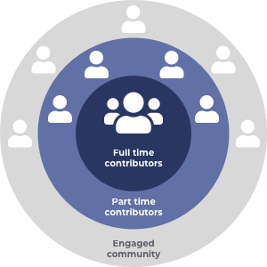

# Overview

Contributors is the approach to bring together a group of community members to help manage, support and improve an ecosystem. Contributors can help in a multitude of areas including working on infrastructure and tooling, supporting the community, improving processes or supporting other projects in the ecosystem.

### Contents

* [**Contributor Funding Model**](broken-reference) - Analysis on how a contributor model helps with achieving ecosystem goals, the common responsibilities for a contributor, desirable attributes for a contributor, risks around using contributors and how to mitigate them and future improvements to the contributor model.&#x20;
* ****[**Approaches**](broken-reference) - Analysis on a number of contributor approaches that could be used when applying a contributor funding model.
* [**Analysis**](broken-reference) - Analysis comparing the different contributor types that have been created for use in Cardano and also comparing Catalyst Contributors with the Catalyst Circle approach.
* [**Contributor Governance**](broken-reference) - Analysis for how contributors could handle rapid funding and exploring different governance decision examples.
* [**Salary Research**](broken-reference) - Research into average salaries for the different roles that are relevant to full time contributors.
